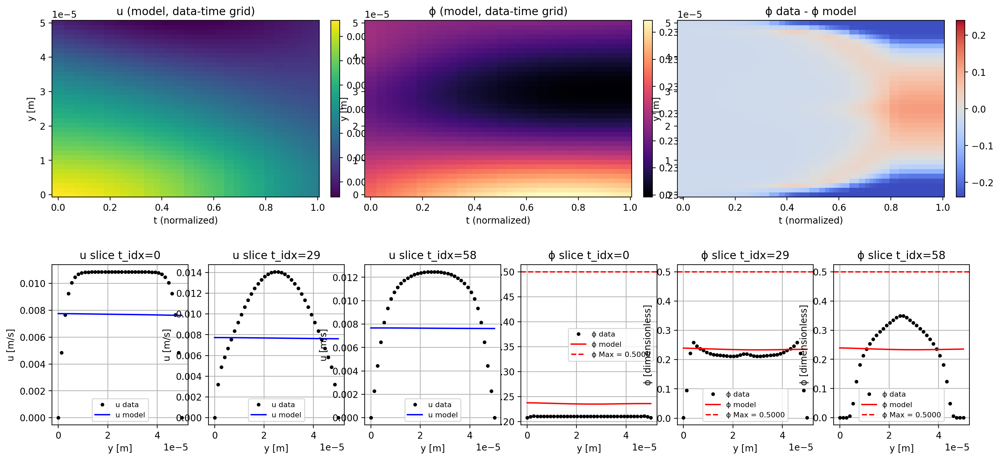
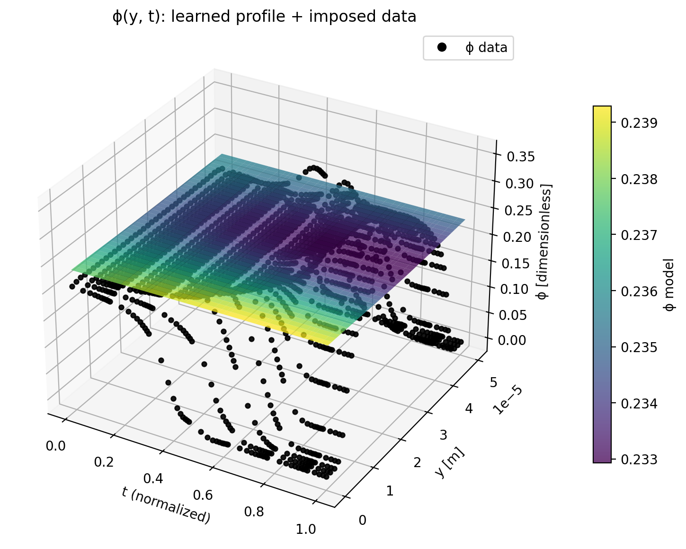

# 1D-1D Transient PINN for Suspension Flow

Physics-informed neural network (PINN) code for learning transient 1D channel flow fields:
- `u(y, t)`: streamwise velocity
- `phi(y, t)`: particle volume fraction

The model combines:
- data fitting to transient simulation/measurement CSV files,
- suspension-balance PDE residuals,
- wall/bulk/symmetry constraints,
- adaptive loss balancing by gradient normalization.

This repository is set up for inverse or forward studies of suspension transport in microchannel flow.

## What this model does

Given a set of transient snapshots in `data/transientdata/*.csv` and physical constants in `data/transientdata/parameters.yaml`, the training loop:
1. builds a PINN over `(y, t)`,
2. enforces PDE and physics constraints,
3. fits observed velocity data,
4. predicts `phi(y, t)` profiles over time.

## Model summary

- Input: normalized `(y, t)` where `y in [-1, 1]` and `t` is log-normalized.
- Network:
  - Fourier feature input layer (`architecture.py`)
  - fully connected MLP
  - 2 outputs (mapped through sigmoid):
    - `u` (normalized velocity)
    - `phi` (scaled by `phi_max`)
- Optimizer: SOAP (`soap.py`)
- Loss terms (`loss.py`):
  - migration flux divergence
  - wall flux condition
  - momentum balance residuals
  - bulk concentration conservation
  - initial/final concentration boundary terms
  - symmetry terms
  - supervised velocity data mismatch

## Repository layout

```text
.
├── main.py                # entry point
├── architecture.py        # PINN + trial functions
├── params.py              # data loading + nondimensionalization
├── loss.py                # physics/data residuals and adaptive weighting
├── training.py            # training loop
├── plot.py                # visualization outputs
├── config.py              # hyperparameters and run options
└── data/transientdata/    # CSV snapshots + parameters.yaml
```

## Requirements

Python 3.10+ recommended.

Install dependencies:

```bash
pip install torch pandas pyyaml numpy matplotlib
```

## Quick start

1. Put your data in:
   - `data/transientdata/*.csv`
   - `data/transientdata/parameters.yaml`
2. Adjust hyperparameters in `config.py` (epochs, collocation points, weights, etc.).
3. Run training:

```bash
python main.py
```

## Data format

Each CSV snapshot should include at least these columns used by the loader:
- `Time`
- `arc_length`
- `U:0` (streamwise velocity)
- `c` (particle concentration)
- `p` (pressure)

`parameters.yaml` supplies physical/model constants such as:
- `phi_bulk`, `phi_max`
- `H`, `rho`, `eta`
- `Kn`, `lambda2`, `lambda3`, `alpha`
- `beta`, `a`, `H0`, `frv`
- `drho_dx`, `CFL`

## Key configuration options

In `config.py`:
- `USE_GPU`: use MPS/CUDA when available
- `EPOCHS`, `NEURONS`, `SCALE`
- `t_COLL`, `y_COLL`
- `ACTIVATION`
- `T_COLL_EXPONENT` (time-grid warping)
- global weights (`Λ_PDEs`, `Λ_BCs`, `Λ_data`) for objective emphasis

Notes:
- Inverse setup: `Λ_data > 0`
- Forward setup: `Λ_data = 0`

## Outputs

Training writes figures to `results/`:
- `viz.png`: heatmaps + slice comparisons
- `viz_phi_3d.png`: 3D `phi(y, t)` surface with data overlay

## Example visualizations




## Assets showcase

Add your custom image(s) under `assets/` and reference them like this:

```md

```

Default slot (rename file as needed):


## Citation notes

The implementation references:
- Fourier features for coordinate encoding
- self-adaptive weighting ideas for PINNs
- SOAP optimizer implementation adapted in `soap.py`
