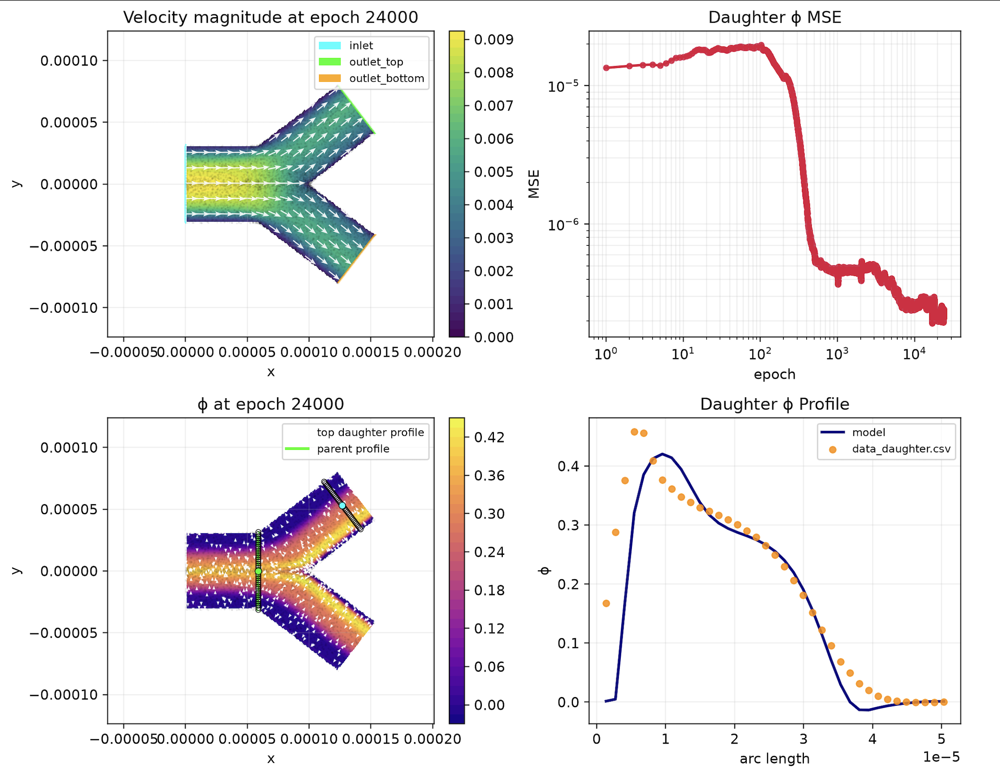
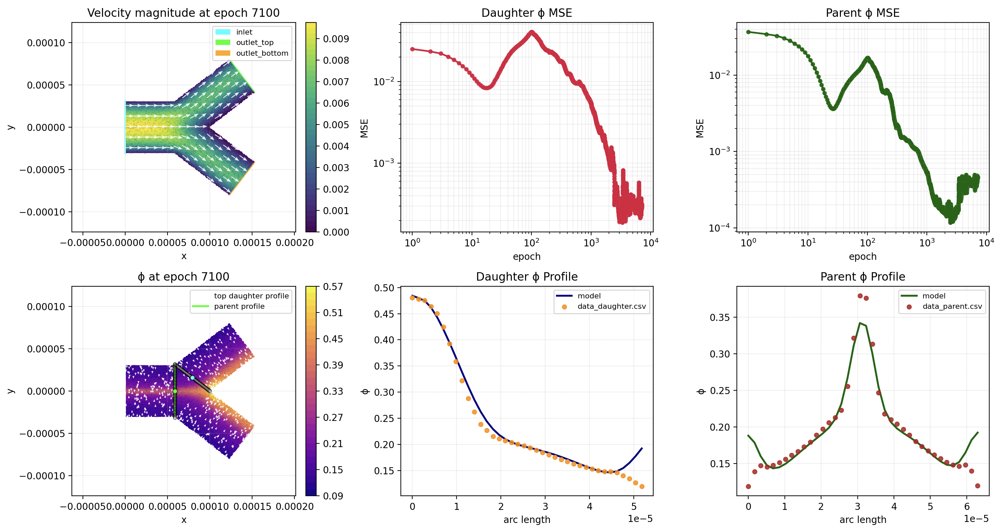
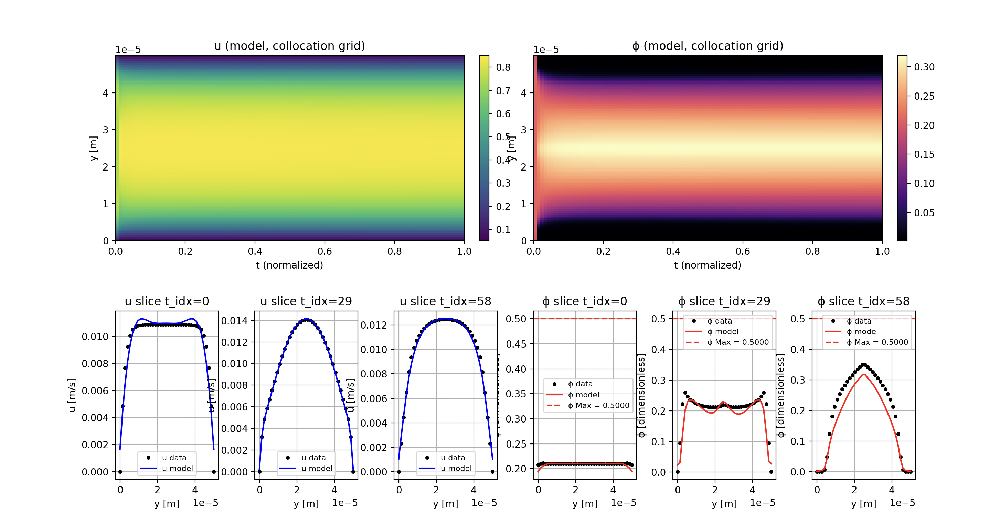
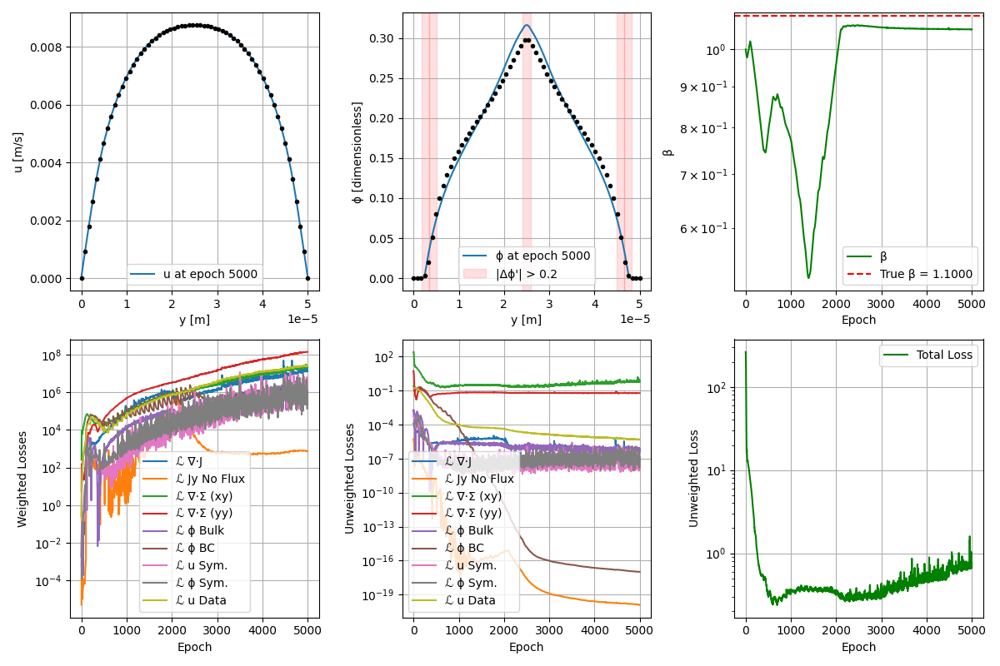

# MSBM PINNs for Suspension Flow

## Visuals

### Steady-State (2D)




### Transient (1D×1D)


### Steady-State (1D)



Physics-informed neural networks (PINNs) for **suspension-balance / migration** modeling in channel flow, including:

- **1D steady-state MSBM PINN** (`1D_steady_state/`)
- **1D×1D transient PINN** (`1D_1D_transient/`)
- **2D steady-state MSBM PINN** (`2D_steady_state/`)

The models learn velocity and concentration fields:
- **Steady 1D:** `u(y)`, `phi(y)`
- **Transient:** `u(y, t)`, `phi(y, t)`
- **Steady 2D:** `u(y, x)`, `v(y, x)`, `phi(y, x), p(y, x)`

Each model uses:
- **Fourier-feature coordinate embeddings** (`architecture.py`)
- **Coupled physics residuals** (migration + momentum) (`loss.py`)
- **Wall/bulk/symmetry constraints**
- **Adaptive loss balancing**
  - spatial self-adaptive λ fields (`lambda_*`)
  - gradient-normalized global balancing of loss terms
- **SOAP optimizer** for PINN weights (`soap.py`) + Adam ascent on adaptive weights

---

## Repository layout

```text
.
├── 1D_steady_state/
│   ├── main.py                # entry point
│   ├── config.py              # experiment/training configuration
│   ├── architecture.py        # PINN definition + trial functions
│   ├── params.py              # data/parameter loading and normalization
│   ├── loss.py                # physics + constraint losses
│   ├── training.py            # training loop
│   ├── plot.py                # live plotting + saved figures
│   ├── soap.py                # SOAP optimizer implementation
│   ├── paths.py               # output paths
│   └── data/
│       ├── synthetic_data_example_1/
│       │   ├── data.csv
│       │   └── parameters.yaml
│       └── ...
│
├── 1D_1D_transient/
│   ├── main.py                # entry point
│   ├── config.py              # hyperparameters and run options
│   ├── architecture.py        # PINN + trial functions
│   ├── params.py              # data loading + nondimensionalization
│   ├── loss.py                # physics/data residuals + adaptive weighting
│   ├── training.py            # training loop
│   ├── plot.py                # visualization outputs
│   ├── soap.py                # SOAP optimizer implementation
│   └── data/
│       └── transientdata/
│           ├── *.csv
│           └── parameters.yaml
│
├── 2D_steady_state/
│   ├── main.py                # entry point
│   ├── config.py              # hyperparameters and run options
│   ├── architecture.py        # PINN + trial functions
│   ├── params.py              # data loading + nondimensionalization
│   ├── loss.py                # physics/data residuals + adaptive weighting
│   ├── loss_scheme.py         # loss weighting scheme
│   ├── training.py            # training loop
│   ├── plot.py                # visualization outputs
│   ├── geometry.py            # geometry utilities + masks
│   ├── visualize.py           # extra visualization helpers
│   ├── soap.py                # SOAP optimizer implementation
│   ├── paths.py               # path helpers
│   ├── loss_old.py            # legacy loss
│   └── data/
│       └── fakedata1/
│           ├── *.csv
│           └── parameters.yaml
│
└── assets/
    ├── steady_state_example.png
    └── transient_example.png
```

## Requirements

Recommended Python: `3.9+`

Install core dependencies:

```bash
pip install torch pandas pyyaml matplotlib numpy
```

## Data Format

Each dataset directory under `data/` must contain:

1. `data.csv` with columns:
   - `y` (position, m)
   - `phi` (volume fraction)
   - `u` (velocity, m/s)
2. `parameters.yaml` with physical/model parameters used in `params.py`:
   - `phi_bulk`, `phi_max`, `H`, `rho`, `eta`, `Kn`, `lambda2`, `lambda3`, `alpha`, `beta`, `a`, `H0`, `frv`, `p`, `drho_dx`, `CFL`

## Configure an Experiment

Edit `config.py`:

- `DATA_DIR`: select dataset folder inside `data/`
- `CASE`: `"learn cfl"` or `"learn beta"`
- `EPOCHS`, `COLL`, `NEURONS`, `ACTIVATION`, etc.
- `VISUALIZE_STEPS` and `SAVE_STEPS` control plotting frequency
- `USE_GPU = True` to prefer `mps`/`cuda` when available

## Run

```bash
python main.py
```

At runtime, the script:
1. selects device (`mps`, `cuda`, or `cpu`)
2. builds the PINN and trial functions
3. loads and normalizes data/physical parameters
4. trains with SOAP + adaptive loss weighting
5. plots progress and saves snapshots to `visuals/`

## Outputs

- Console logs each epoch:
  - total unweighted loss
  - normalized pressure-gradient term (`dp_dx_`)
  - current `beta` value
  - `phi` MSE on data points
- For steady state, training writes figures to `visuals/`:
  - `plot_epoch_<N>.png`
- For transient, training writes figures to `results/`:
- `viz.png`: heatmaps + slice comparisons
- `viz_phi_3d.png`: 3D `phi(y, t)` surface with data overlay

## References

J. D. Toscano, V. Oommen, A. J. Varghese, Z. Zou, N. A. Daryakenari, C. Wu, and G. E. Karniadakis, “From PINNs to PIKANs: Recent Advances in Physics-Informed Machine Learning,” 2024. [Online]. Available: Brown University, Division of Applied Mathematics.

K. L. Lim, R. Dutta, and M. Rotaru, “Physics informed neural network using finite difference method,” 2022 IEEE International Conference on Systems, Man, and Cybernetics (SMC), IEEE, 2022, pp. 1828–1833.

A. D. Jagtap, D. Mitsotakis, and G. E. Karniadakis, “Deep learning of inverse water waves problems using multi-fidelity data: Application to Serre–Green–Naghdi equations,” Ocean Engineering, vol. 248, 2022, 110775.

Dbouk, Talib, Elisabeth Lemaire, Laurent Lobry, and Fady Moukalled. “Shear-induced particle migration: Predictions from experimental evaluation of the particle stress tensor.” Journal of Non-Newtonian Fluid Mechanics 198 (2013): 78–95. DOI: 10.1016/j.jnnfm.2013.03.006

McClenny, Levi D., and Ulisses M. Braga-Neto. “Self-adaptive physics-informed neural networks.” Journal of Computational Physics 474 (2023): 111722. DOI: 10.1016/j.jcp.2022.111722

M. Tancik, P. Srinivasan, B. Mildenhall, et al., “Fourier Features Let Networks Learn High Frequency Functions in Low Dimensional Domains,” arXiv preprint arXiv:2006.10739, 2020.

Bilionis, Ilias¹; Hans, Atharva². A Hands‑on Introduction to Physics‑Informed Neural Networks. ¹ Mechanical Engineering, Purdue University, West Lafayette, IN; ² Design Engineering Lab, Purdue University, West Lafayette, IN.
